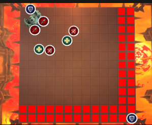

# Sanctum of Domination

## DPS only heroic guide
- [Sanctum of Domination](#sanctum-of-domination)
  - [DPS only heroic guide](#dps-only-heroic-guide)
  - [Tarragrue](#tarragrue)
  - [Eye of the Jailer](#eye-of-the-jailer)
  - [The Nine](#the-nine)
  - [Remnant of Ner'Zhul](#remnant-of-nerzhul)
  - [Soulrender Dormazain](#soulrender-dormazain)
  - [Painsmith Raznal](#painsmith-raznal)
  - [Guardian of the First Ones](#guardian-of-the-first-ones)
  - [Fatescribe Roh-Kalo](#fatescribe-roh-kalo)
  - [Kel'Thuzad](#kelthuzad)
  - [Sylvanas Windrunner](#sylvanas-windrunner)

---

## Tarragrue

> **Phase 1**. 

**Chains of Eternity** : Call for immune or help out 

**Predator’s Howl** : Avoid purple circle

**Remnant of Forgotten Torments** : Soak the gray circle

> **Interphase**. 

Find safe spot to stand in

> **Phase 2**. 

Kill this fu***** boss

---

## Eye of the Jailer

> **Phase 1**. 

**Dragging Chains** : Stack on the hooked player and run away

**Annihilating Glare** : Click the chain to jump to other side during beam

**Soul Shatter** : Dodge the AoE (if you get hit, walk on a soul)

> **Phase 2**. 

**Stygian Ejection** : Kill adds at the same time

**Spreading Misery** : Spread out to get dispelled

**Desolation Beam** : Spread out quick

**Soul Shatter** : Dodge or walk on souls

---

## The Nine
> **Phase 1**. 

**Wings of Rage :** Run from the suck

**Reverberating Refrain** : Run inside the zone

**Agatha’s Eternal Blade** : Dodge the lines

**Daschla’s Mighty Anvil** : Spread out with giant purple circle

**Annhylde’s Bright Aegis** : Drag bosses out of the zone

**Aradne’s Falling Strike** : Soak the purple zone

**Brynja’s Mournful Dirge** : Spread if you have a small circle

**Arthura’s Crushing Gaze** : Soak for your friend

**--> Kick the adds <--**

> **Phase 2**. 

**Fragments of Destiny** : Run to the debuffed player and get dispelled

---

## Remnant of Ner'Zhul

> **Phase 1**.

**Malevolence** : Go to the edge and don't get knocked off

**Orb of Torment** :  Kill the orbs and throw them off

**Grasp of Malice** : Dodge the black beams

**Shatter** : Dodge the circles

---

## Soulrender Dormazain

> **Phase 1**.

**Torment** : Go to safe spot

**Tormented Eruptions** : Run to safe spot

**Rendered Soul** : Dodge the circles

**Warmonger Shackles** : Drag a shackle to the back

**Brand of Torment** :  When you have the big red circle, stack on adds when they spawn 

**--> Kick and don't let adds reach the Garrosh <--**

---

## Painsmith Raznal

> **Phase 1**.

**Cruciform Axe** : Don't stand on the same X/Y axis as the tank

**Reverberating Hammer** : Dodge the spikes

**Dualblade Scythe** : Dodge the spikes

**Spiked Balls** : Kill a ball 

**Flameclasp Trap** : Trigger traps (not all at once)

**Shadowsteel Chains** : Spread if you have chains

> **Intermission**

**Forge Weapon** : Dodge the spikes

---

## Guardian of the First Ones

> **Phase 1**.

**Energizing Link** : Get inside the white zone

**Meltdown** : Run from explosion

**Disintegration** : Dodge the beam

**Form Sentry** : Dodge the orbs

**Threat Neutralization** : Spread out with bombs

**Elimination Pattern** : Soak the tank

---

## Fatescribe Roh-Kalo

> **Phase 1**.

**Fated Conjunction** : Dodge the beams

**Call of Eternity** : Dodge bombs opposite direction from previous set

**Invoke Destiny** : Kill the adds that spawns

> **Phase 2**.

**Roh-Kalo's Mini Game** : Move the runes in the sockets

**Fate Fragment** : Dodge the orbs

**--> Kick and kill the adds <--**

> **Phase 3**.

**Extemporaneous Fate** : Stand on the rune when assigned

---

## Kel'Thuzad

> **Phase 1**.

**Howling Blizzard** : Run to safe spot

**Oblivion’s Echo** : Run silencing zone to the edge

**Relentless Haunt** : Kite, CC and kill the adds

**Glacial Wrath** : Kill your assigned spike

**Frost Blast** : Soak for your friend

**Soul Fracture** : Kick and kill the adds

---

## Sylvanas Windrunner

> **Phase 1**.

**Windrunner** : Dodge the AoE

**Desecrating Shot** : Dodge circles

**Domination Chains** : Step on an arrow to reset bleed and kill them

**Veil of Darkness** : Dodge the AoE

> **Intermission**.

**Domination Chains** : Kill the arrows and dodge

**Rive** : Dodge the lines and circles

**Banshee Wail** : Spread with circle

> **Phase 2**.

**Ruin** : Kick

**Haunting Wave** : Dodge the projectiles

**Veil of Darkness** : Dodge the AoE

**Banshee Wail** : Spread out

**--> Kick and kill the adds <--**

> **Phase 3**.

**Banshee’s Bane** : If you get the debuff, move to the side and clean the floor

**Wailing Arrow** : Spread from others

**Veil of Darkness** : Spread from others

**Banshee Scream** :  Spread from others

**Shadow Dagger** : Move out of lines

**Raze** : Jump to another platform

**Bane Arrows** : Dodge

---